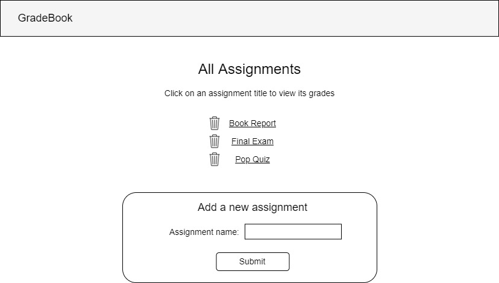
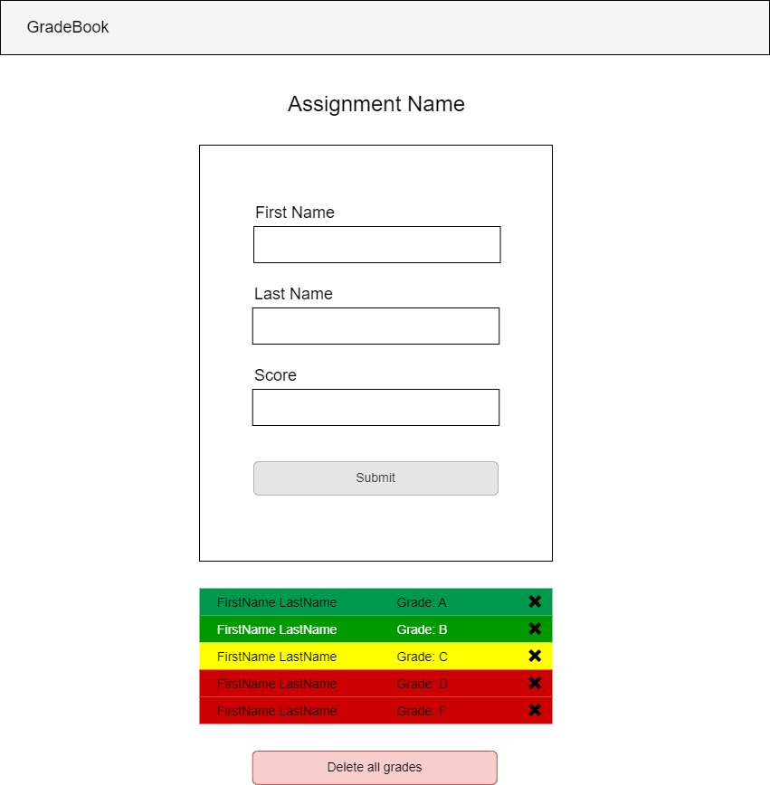

# Gradebook Assistant - Part 3 - Multiple pages and scripts

## Assignment

Your task is to build a front-end application using HTML, CSS, and JavaScript. This application will act as a tool that a teacher could use to track and sort the grades for students in a class. Over time, you will continuosly build upon this application by adding new features and improving old ones.

In part three, your application will expand in complexity to group grades into 'assignments'. Your data will now be an array of assignment objects with an array of grade objects inside them (along with any other properites you want/need to add). Your website will also go from one page to two pages. The html page you have already built will become the second page of your application. You will make a new index.html that will now display a list of all assignments, and when you click on an assignment you will be brought to a page with that assignment's grade table.

Hint: You will also want to make at least two javascript files to go with your two html files. You may include more than one ```<script>``` on an HTML page. Take care with the order in which you write the links, order matters!

## Wire Frames
index.html



assignment.html



## User Story

```md
AS A teacher
I WANT the ability to add assignments and grades to the database
SO THAT I can track my students grades organized by assignment
```

## Requirements

```md
GIVEN a front-end application that takes student test scores
WHEN I navigate to my 'all assignments' page
THEN I can see a list of existing assignments and I can create a new assignment.
WHEN I click on the link to any one assignment
THEN I am taken to the 'single assignment' page with information for that assignment dynamically rendered
WHEN I add a grade using the add grade form on the single assignment page
THEN the grades table is rerendered to include that new grade.
```

## Recommended Documentation

### Objects

- [W3 Schools](https://www.w3schools.com/js/js_objects.asp)
- [MDN](https://developer.mozilla.org/en-US/docs/Web/JavaScript/Reference/Global_Objects/Object)

### Insert Heading (Video)

- [Modern JS Objects Tutorial](https://www.youtube.com/watch?v=X0ipw1k7ygU)